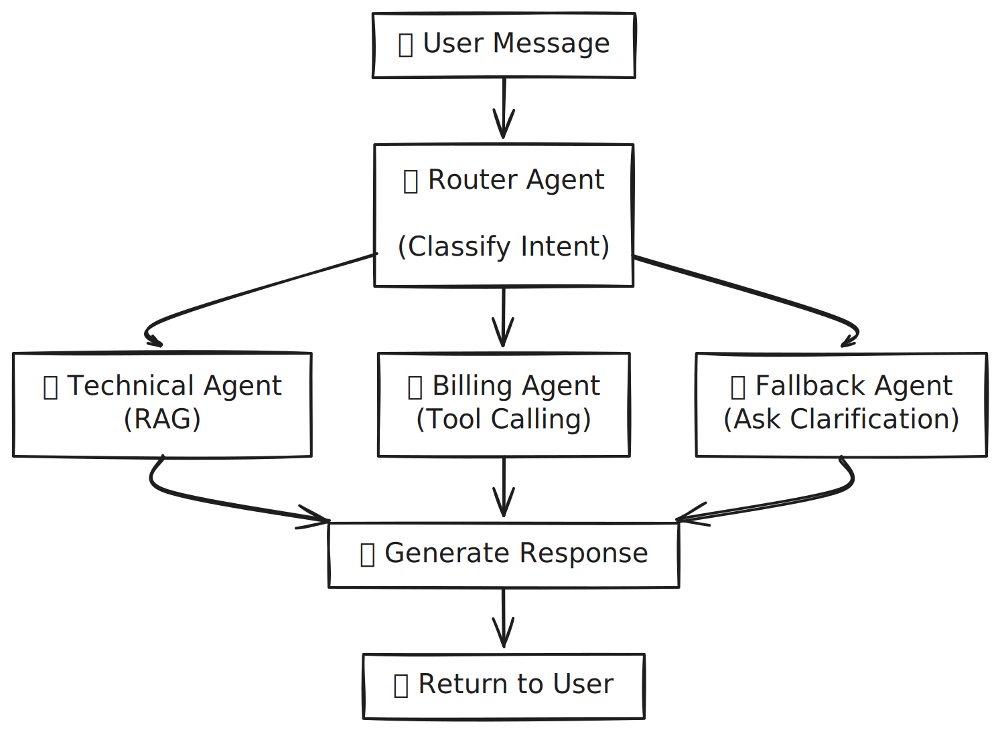

# Telecom Support AI Agents - Flow Visualization

## Architecture Flow Diagram

This document contains the visual representation of the multi-agent system flow.

## System Flow Diagram

Embed the SVG visualization here:



---

### How It Works

1. **User sends a message** via FastAPI endpoint
2. **Router Agent** classifies the intent (technical, billing, or other)
3. **Specialist Agent** handles the request based on classification:
   - **Technical Agent**: Retrieves from knowledge base (RAG)
   - **Billing Agent**: Calls tools for subscription/refund operations
   - **Fallback Agent**: Asks for clarification
4. **Response is generated** with sources/tools used
5. **State is updated** and returned to user

---

## Component Breakdown

### Router Agent
- **Input**: User message + conversation history
- **Process**: LLM-based intent classification
- **Output**: Route decision + confidence score

### Technical Agent
- **Input**: User message
- **Process**: FAISS retrieval → NO_CONTEXT check → LLM generation
- **Output**: Response + sources

### Billing Agent
- **Input**: User message + user_id
- **Process**: Tool-calling (get_subscription, open_refund_case, get_refund_policy)
- **Output**: Response + tools used

### Fallback Agent
- **Input**: User message
- **Process**: Show clarification template + weak route hint
- **Output**: Response asking for clarification

---

## Data Flow in Each Turn

### Turn 1: Initial Technical Query
```
User: "Internet is down"
  ↓
Router: technical (confidence 0.95)
  ↓
TechnicalAgent: Retrieve docs, generate response
  ↓
Response: "Based on the knowledge base..." + sources
  ↓
State: history=[user_msg, agent_msg], last_agent="technical"
```

### Turn 2: Follow-up (Same Agent)
```
User: "PON LED blinking"
  ↓
Router: technical (confidence 0.89) + context awareness
  ↓
TechnicalAgent: Stay in thread, retrieve new docs
  ↓
Response: "The PON LED..." + new sources
  ↓
State: history=[...prev_turn..., user_msg, agent_msg], last_agent="technical"
```

### Turn 3: Pivot (New Agent)
```
User: "What's the refund?"
  ↓
Router: billing (confidence 0.92, overrides context)
  ↓
BillingAgent: Call tools
  ↓
Response: "Your refund case R10001..." + case_id
  ↓
State: history=[...], last_agent="billing"
```

---

## Key Safeguards

### Hallucination Prevention
1. **Intent Routing** - Pre-filter off-topic queries
2. **NO_CONTEXT Threshold** - Reject weak retrieval results (score < 0.5, hits < 3)
3. **Mandatory Source Citation** - Every claim attributed to a source
4. **System Prompts** - LLM explicitly told "never invent facts"
5. **Tool Calling** - Billing agent can't hallucinate (deterministic tools)

### State Management
- All conversation history preserved
- Multi-turn context maintained
- Easy to audit: print state at any point
- Session-based: one state per user session

---

## Performance Characteristics

- **Typical response time**: 1-2 seconds per turn
- **FAISS retrieval**: ~100ms (local vector search)
- **LLM inference**: ~1-1.5 seconds
- **Token budget**: 8KB context max for technical agent
- **History truncation**: Last 12 messages for billing agent

---

## Integration Points

### External Services
- **OpenAI LLM**: GPT-4o-mini for classification and generation
- **OpenAI Embeddings**: text-embedding-3-small for vector search
- **FAISS**: Local vector database (runs in-process)

### Internal Systems
- **FastAPI**: REST API endpoint
- **LangGraph**: State machine orchestration
- **Pydantic**: Input/output validation
- **LangChain**: Tool framework + agent abstractions

---

## Quick Start

To test the flow locally:

```bash
# Start the API
uvicorn main:app --reload --port 8000

# Make a request
curl -X POST http://localhost:8000/chat \
  -H "Content-Type: application/json" \
  -d '{
    "session_id": "test_session",
    "message": "My internet is down",
    "user_id": "u123"
  }'
```

Response:
```json
{
  "reply": "Based on the knowledge base...",
  "route": "technical",
  "last_agent": "technical",
  "sources": [...],
  "used_tools": null,
  "state_excerpt": {...}
}
```

---

## See Also

- **SYSTEM_ARCHITECTURE.md** - Complete detailed documentation
- **HALLUCINATION_PREVENTION.md** - Deep dive into safety mechanisms
- **QUICK_REFERENCE.md** - Quick developer guide
- **SIMPLE_AGENT_FLOW.md** - Simplified text/ASCII diagrams
